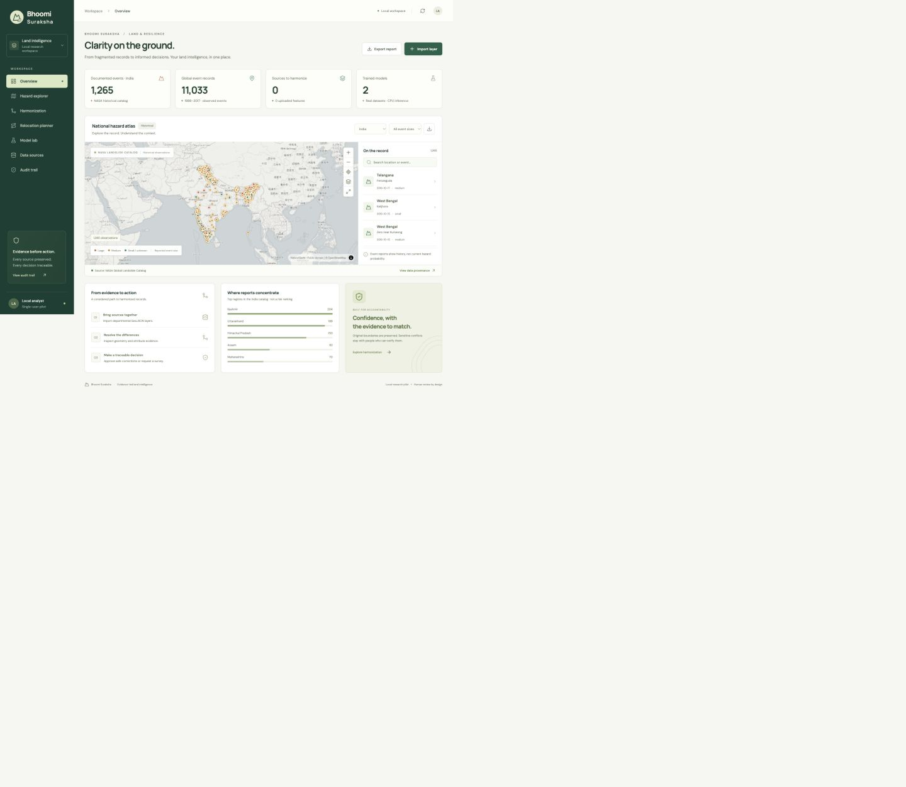

# Bhoomi Suraksha

An evidence-led geospatial workspace for land-record harmonization and relocation screening. Built from [Land_registry_Sustainable_project](https://github.com/doraem-on/Land_registry_Sustainable_project); the original implementation is preserved in `legacy/` and Git history.

**Run locally: http://localhost:3000**



This is a working **local research pilot**, with real public observations, two actually trained models, persistent reviews, and no paid AI API dependency. It does not claim government integration, certified boundaries, live hazard forecasts, or validated relocation approval.

## Start

Requires Node 22+ and Python 3.12. The trained models and derived event catalog are included, so downloading or training is not required to run the app.

```bash
git clone https://github.com/doraem-on/SIH_PS2.git
cd SIH_PS2
PYTHON_BIN=python3.12 npm run setup
npm start
```

Open **http://localhost:3000**. The Node web server starts the Python analysis service automatically on `127.0.0.1:8001`. Both bind locally by default. If using a different Python executable, pass `PYTHON_BIN` during setup. Run `PORT=3002 npm start` if port 3000 is occupied (the analysis port must still be available).

Development: run `.venv/bin/python -m uvicorn ml.api:app --host 127.0.0.1 --port 8001` and `npm run dev` in separate terminals. Production frontend: `npm run build`.

Docker packaging is supplied: `docker compose up --build`. Port 3000 is published on loopback only. The database persists in a named volume. Docker execution is not part of the locally verified setup.

## What works

- **Hazard atlas:** MapLibre map with 11,033 NASA historical landslide observations, including 1,265 in India. Filter by country, reported size, year, and text; inspect report details and original source links; export the displayed GeoJSON. Key-free OpenStreetMap tiles and local Natural Earth country outlines.
- **Source ingestion:** WGS84 GeoJSON imports, feature and coordinate validation, immutable originals, checksums, and source lineage. Six layer types: cadastral, revenue, survey, habitation, site, hazard. Up to 250 features per layer for bounded local processing.
- **Spatial matching:** metric-area IoU in a local equal-area projection; geodesic centroid distance; attribute agreement with missingness penalties; explicit, user-declared source quality. No learned probability is implied by this score.
- **Topology and conflicts:** detects invalid geometry, within-layer overlaps, ambiguous matches, many-to-one matches, missing legal evidence, and ownership/title/boundary conflicts. Invalid topology gets a `make_valid` preview, never a silent rewrite. Gaps cannot be determined without an authoritative expected coverage boundary and are not automatically inferred.
- **Review and reversible corrections:** three confidence tiers, human reasons, approve/reject/field/revert actions, derived GeoJSON exports with review/source lineage. Nonlegal `land_use` proposals normalize values and use the explicit pilot precedence **survey > cadastral > revenue**; ties preserve the reference. This is a reviewable convention, not statutory authority. Legal attributes and geometries are never overwritten.
- **Relocation screening:** intersects supplied hazard polygons, measures site area geodesically, checks water and space capacity, and lists nearby exposed habitations from supplied population attributes. Capacity is `min(floor(area / m² per person), floor(water_lpd / litres per person per day))`. Missing data is “not assessed”; hazard intersections exclude sites. All remaining sites require official verification. Defaults are editable planning assumptions, not asserted regulations.
- **Real inference:** saved scikit-learn artifacts run in the API, with checksum verification, input validation, full probability distributions, test metrics, baselines, confusion matrices, and downloadable model cards.
- **Audit:** SQLite transactions and SHA-256-linked records capture imports, matching, decisions, reversals, and screening. An integrity check runs when the audit is read. This is not an externally notarized or tamper-proof ledger.

## Actually trained models

| Model | Real dataset | Train / test rows | Holdout accuracy | Majority baseline | Balanced accuracy |
|---|---|---:|---:|---:|---:|
| Landslide event-size Random Forest | NASA Global Landslide Catalog | 8,138 / 2,035 | 51.11% | 43.59% | 47.97% |
| Terrain-to-forest-cover Extra Trees | UCI Covertype / US Forest Service | 120,000 / 30,000 | 91.13% | 48.76% | 83.59% |

**Interpret these metrics correctly:**

- Landslide size classifies the size of an *already reported event*. It does not estimate whether a landslide will occur. The holdout uses entire dates on/after 2016-05-11; training uses earlier dates. `very_large` and `catastrophic` labels are grouped with `large`; unknown sizes are excluded. No report text, casualties, or size-derived outcomes enter the predictors. The temporal performance is modest and displayed without embellishment.
- Covertype uses a deterministic stratified 150,000-row sample from 581,012 real observations and the first ten continuous cartographic features. The split is stratified random, so spatial autocorrelation may inflate generalization estimates. Its Colorado labels are **not validated for India** and never drive Indian land-cover or site-safety claims. This is not a drone image segmentation model.
- Both use seed 42. Metrics are generated by `ml/train.py`; no synthetic training labels or invented performance figures are used. Probabilities are uncalibrated. See `models/registry.json` for complete model cards, class counts, confusion matrices, versions, and artifact hashes.

### Reproduce the training

```bash
.venv/bin/python scripts/download_data.py
npm run train
npm test
```

The downloader verifies the source checksums in `data/derived/provenance.json` and fails if upstream data changes. Raw data is not committed. Training is CPU-only and persists both compressed model artifacts. Restart `npm start` after retraining to clear cached models.

## Input data contract

Provide a GeoJSON `FeatureCollection` in EPSG:4326 (longitude, latitude); no legacy `crs` field. IDs must be unique within each source. Large files should be split into layers of at most 250 features.

| Layer | Geometry | Useful properties |
|---|---|---|
| Cadastral / revenue / survey | Polygon or MultiPolygon | `parcel_id`, `owner`, `title_id`, `land_use` |
| Site | Polygon or MultiPolygon | `name`, `water_lpd` (nonnegative litres/day) |
| Habitation | Point, Polygon, or MultiPolygon | `name`, `population` (nonnegative people) |
| Hazard | Polygon or MultiPolygon | source-specific description and provenance |

Missing legal attributes force field verification. Uploading a source does not establish its official authority. An empty initial review queue is intentional: no fictional owners, titles, village populations, or candidate capacities are preloaded. Synthetic geometries exist **only as isolated automated test fixtures**, never as training data or displayed official records.

## Data attribution

- [NASA Global Landslide Catalog](https://catalog.data.gov/dataset/global-landslide-catalog-export): public historical export, reporting-biased and incomplete. NASA catalog metadata does not specify a license. Preserve NASA credit and the per-event reporting links. The UI displays the observed date span, not the catalog webpage's update date as a fictitious live-feed date.
- [UCI Covertype](https://archive.ics.uci.edu/dataset/31/covertype): Blackard, J. (1998), DOI [10.24432/C50K5N](https://doi.org/10.24432/C50K5N), CC BY 4.0. US Forest Service Region 2 observations. Attribution is retained in the model card and UI.
- [Natural Earth](https://www.naturalearthdata.com/about/terms-of-use/): public-domain country outlines, for cartographic context only; not authoritative legal boundaries.
- [OpenStreetMap contributors](https://www.openstreetmap.org/copyright): online basemap, attribution retained. Tiles need network access; local country outlines and observations remain available without tiles. Google Fonts are optional network-loaded presentation assets with system-font fallbacks.

## Architecture and verification

React + TypeScript + Vite + MapLibre frontend; Express same-origin gateway; Python FastAPI / scikit-learn / Shapely / PyProj analysis; SQLite local workspace persistence. The original PostgreSQL/PostGIS schema remains archived in `legacy/db/`; the active app uses SQLite for a zero-service local startup.

```bash
npm run build      # TypeScript + production bundle
npm test           # 12 end-to-end API / geometry / model integrity tests
npm audit          # dependency vulnerability audit
```

The tests cover immutable imports, approval/reversal, legal conflict blocking, missing evidence, shifted boundaries, overlaps, many-to-one matches, explicit precedence, invalid data, capacity rules, audit tampering, real catalog filtering, and saved-model inference. Browser checks cover the real map and both inference forms, with mobile and desktop layout checks.

See [implementation status](docs/IMPLEMENTATION_STATUS.md) for what is delivered versus what requires authoritative data or further validation. Do not expose this local single-user app as a public multi-user service without authentication, access control, operational validation, and deployment hardening.
