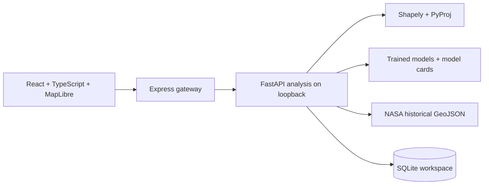

# Bhoomi Suraksha

**Evidence-led land-record harmonization, historical hazard exploration, and relocation screening.**

Built from [Land_registry_Sustainable_project](https://github.com/doraem-on/Land_registry_Sustainable_project). The original implementation and Git history are retained; the previous application is archived under [`legacy/`](legacy/). This repository contains the active, redesigned application.

[Local application](http://localhost:3000) · [Implementation boundaries](docs/IMPLEMENTATION_STATUS.md) · [Model cards](models/registry.json) · [Data provenance](data/derived/provenance.json)


This is a working **research pilot** with real public observations, two trained models, upload-driven spatial analysis, review workflows, and auditable decisions. It does not claim government integration, certified boundaries, operational disaster prediction, or approved relocation decisions. The initial land-record workspace is empty intentionally: no fictional owners, titles, population figures, or safe sites are presented as real.

## Quick start

Requires **Node.js 22+ and Python 3.12**. Trained weights and the derived historical catalog are included. No paid AI API key, GPU, Postgres service, or retraining is needed to start.

```bash
git clone https://github.com/doraem-on/SIH_PS2.git
cd SIH_PS2
PYTHON_BIN=python3.12 npm run setup
npm start
```

Open **http://localhost:3000**. Express starts the Python analysis service automatically on `127.0.0.1:8001`. Both listen locally by default. Stop both with Ctrl+C.

```bash
# Alternative ports if another app is running:
PORT=3002 API_PORT=8002 npm start

# Optional low-memory inference representation, also generated by Docker:
.venv/bin/python scripts/prepare-models.py
```

For development, start `.venv/bin/python -m uvicorn ml.api:app --host 127.0.0.1 --port 8001` and `npm run dev` in separate terminals. Vite proxies API requests to port 8001. `npm run build` creates the production UI and copies the MapLibre worker assets.

## Features and workflow

| Workspace       | What it does                                                                                                        | Evidence and limits                                                              |
| --------------- | ------------------------------------------------------------------------------------------------------------------- | -------------------------------------------------------------------------------- |
| Overview        | Summarizes imported sources, reviews, historical events, regional counts, and trained models                        | Counts come from the catalog and workspace database                              |
| Hazard atlas    | Interactive MapLibre map; country, year, reported size, and text filters; event inspection; filtered GeoJSON export | 11,033 NASA historical events, including 1,265 in India; not a live warning feed |
| Source registry | Imports GeoJSON, validates coordinates and IDs, records checksums, stores immutable originals                       | Six layer types; up to 250 features per layer                                    |
| Harmonization   | Matches two departmental layers using geometry, position, attributes, and declared quality                          | Transparent rule-based score; not an ML match probability                        |
| Conflict review | Shows source evidence, score components, original/proposed properties, topology issues, and review tier             | Legal and disputed geometry changes are blocked from approval                    |
| Corrections     | Approve, reject, send for field verification, or revert; export approved derived records                            | Mandatory review reason; original uploads remain unchanged                       |
| Site screening  | Tests supplied hazard intersections, space/water capacity, and nearby exposed habitations                           | Missing evidence stays “not assessed”; all remaining sites require verification  |
| Model lab       | Runs both saved trained models and displays probabilities, holdout metrics, confusion matrices, and model cards     | Uncalibrated research outputs; model scope is shown beside inference             |
| Audit           | Hash-linked import, match, decision, reversal, and screening history; integrity check; downloadable report          | Tamper-evident within the workspace, not an externally notarized ledger          |

A typical workflow is: explore historical observations → import actual departmental layers → compare two sources → inspect conflicts → record a justified decision → export approved derived GeoJSON. To screen relocation sites, also import real site, habitation, and hazard layers.

## Real datasets

### NASA Global Landslide Catalog

- **Catalog:** [NASA GLC metadata](https://catalog.data.gov/dataset/global-landslide-catalog-export).
- **Downloaded file:** [Historical CSV export](https://data.nasa.gov/docs/legacy/Global_Landslide_Catalog_Export/Global_Landslide_Catalog_Export_rows.csv).
- **Used observations:** 11,033 valid, deduplicated historical events; 1,265 in India; observed years 1988–2017.
- **Uses:** atlas, event inspection, historical context for screening, and training the event-size classifier.
- **Cleaning:** parse dates; deduplicate `event_id`; drop missing coordinates/dates; restrict coordinates to supported latitude/longitude bounds; retain source names, links, reported location accuracy, and missing casualty values.
- **Training labels:** `small`, `medium`, `large`; `very_large` and `catastrophic` are grouped with `large`. The 860 observations without a supported size label are excluded from supervised training but remain in the catalog when otherwise valid.
- **Attribution:** NASA catalog metadata does not specify a license; public availability is not treated as a blanket license grant. Preserve NASA attribution and original event-source links.
- **Limitations:** report-based collection, incomplete coverage, approximate coordinates, geographic imbalance, and inconsistent reporting. The catalog webpage update date is not represented as a new observation date.

### UCI Covertype / US Forest Service

- **Dataset:** [UCI Covertype](https://archive.ics.uci.edu/dataset/31/covertype); [download ZIP](https://archive.ics.uci.edu/static/public/31/covertype.zip).
- **Citation:** Blackard, J. (1998). _Covertype_. UCI Machine Learning Repository. DOI [10.24432/C50K5N](https://doi.org/10.24432/C50K5N).
- **License:** CC BY 4.0.
- **Available observations:** 581,012. Training uses a deterministic stratified sample of 150,000 actual rows; no synthetic labels or generated records.
- **Predictors:** the first ten continuous cartographic features. The wilderness-area and soil-type indicator columns are not used.
- **Targets:** Spruce/Fir, Lodgepole Pine, Ponderosa Pine, Cottonwood/Willow, Aspen, Douglas-fir, and Krummholz.
- **Geographic scope:** Colorado forest observations. This benchmark is **not validated for India**, does not classify drone imagery, and is not used to declare Indian land cover or relocation suitability.

### Map context

[Natural Earth](https://www.naturalearthdata.com/about/terms-of-use/) public-domain country outlines are included for cartographic context; they are not cadastral or authoritative legal boundaries. Online tiles are credited to [OpenStreetMap contributors](https://www.openstreetmap.org/copyright). Tiles require network access; bundled outlines and historical observations remain available without them. Google Fonts are optional presentation assets with system-font fallbacks.

### File integrity and reproducibility

[`data/derived/provenance.json`](data/derived/provenance.json) records download URLs and hashes. Raw CSV/ZIP files are ignored by Git; derived events, model cards, and trained weights are committed. The manifest timestamp is generated during the training/export run, not a claim that the upstream source was freshly updated then.

| Artifact        | SHA-256                                                            |
| --------------- | ------------------------------------------------------------------ |
| NASA CSV        | `2c4898899dd4f373c4320e121c5b655ebb5394d431fa42e57ec4828d07d48b04` |
| UCI ZIP         | `89a975c2457cd48e824238ae43c5a3cb762e42c4b4078d9b44a4514055105f6d` |
| Landslide model | `f2a8c34a854c6d4b6835b151fb088b7d551b20a64248e44e0311627a8a3a850f` |
| Forest model    | `6ea208fd0562d21bf815d9a231b15c2cc7a3ea386ca2ca26049f3de86507afa4` |

The downloader checks the pinned source hashes and fails if upstream contents differ. Model loading verifies the artifact hash before deserialization. Only repository-controlled artifacts are loaded; user uploads are never deserialized as Python models.

## Trained models and evaluation

Both models were trained on **29 September 2026**, using Python 3.12.13, scikit-learn 1.9.1, and seed 42. The committed cards contain exact timestamps, input bounds/categories, class order, confusion matrices, per-class precision/recall/F1, train/test sizes, baseline results, software versions, and checksums.

| Metric                           | Landslide event size | Terrain → forest cover |
| -------------------------------- | -------------------: | ---------------------: |
| Algorithm                        |        Random Forest |            Extra Trees |
| Training rows                    |                8,138 |                120,000 |
| Test rows                        |                2,035 |                 30,000 |
| Accuracy                         |               51.11% |                 91.13% |
| Majority-class baseline accuracy |               43.59% |                 48.76% |
| Balanced accuracy                |               47.97% |                 83.59% |
| Macro F1                         |               42.55% |                 86.86% |
| Input features                   |                    6 |                     10 |

### Landslide event-size classifier

Inputs are latitude, longitude, calendar month, reported trigger, landslide category, and setting. Categorical columns use `OneHotEncoder(handle_unknown="ignore")`; the API accepts the documented training categories. The classifier has **140 trees**, maximum depth **16**, minimum leaf size **5**, `balanced_subsample` class weighting, and four training workers.

The holdout is chronological: training dates precede **2016-05-11**, and test dates are on or after that date. Entire calendar dates remain on one side of the split. Casualties, report text, and size-derived outcomes are excluded from predictors.

This classifies the size of an **already reported event**. Reported trigger/category/setting may only be known after an event; this is not an occurrence or advance-warning model. Its modest temporal performance is exposed without adjustment or inflated claims.

### Terrain-to-forest-cover classifier

The model has **100 trees**, maximum depth **24**, minimum leaf size **2**, `max_features=0.85`, and four training workers. Sampling and the 80/20 holdout are stratified with seed 42.

| Input                                              | Unit / meaning                     |
| -------------------------------------------------- | ---------------------------------- |
| `elevation`                                        | metres                             |
| `aspect`                                           | degrees                            |
| `slope`                                            | degrees                            |
| `horizontal_distance_to_hydrology`                 | metres                             |
| `vertical_distance_to_hydrology`                   | metres; signed vertical difference |
| `horizontal_distance_to_roadways`                  | metres                             |
| `hillshade_9am`, `hillshade_noon`, `hillshade_3pm` | shade index                        |
| `horizontal_distance_to_fire_points`               | metres                             |

The random split can overstate performance at geographically independent sites because nearby observations can resemble one another. Accuracy does not prove India-wide validity. Elevation is the strongest impurity-based feature importance in this trained model; importance is descriptive, not causal.

### Inference on small hosting instances

The original compressed sklearn forest remains the training artifact. `scripts/prepare-models.py` exports the same trees into checksum-verified NumPy arrays, loaded with memory mapping. `ml/compact_forest.py` follows the original split thresholds using float32 inputs and averages the same leaf probabilities. It does not train, prune, approximate, or replace the forest. This avoids loading all 3,663,788 nodes as sklearn objects into server memory.

Docker generates this representation during its build; generated arrays are ignored by Git. If absent locally, the API uses the original sklearn artifact. Tests check numerical equivalence and rejection of modified artifacts. On 500 real Covertype rows, maximum probability difference from sklearn was `2.22e-16`. A local macOS smoke check loading both models, the catalog, and one prediction each measured 267 MiB peak Python RSS versus 1,110.5 MiB with the original forest objects. These are local measurements, not a cloud memory guarantee. Rebuild the representation after retraining.

### Reproduce training

```bash
.venv/bin/python scripts/download_data.py
npm run train
.venv/bin/python scripts/prepare-models.py
npm test
```

Training is CPU-only. It writes `models/*.joblib`, `models/registry.json`, `data/derived/events.geojson`, and the provenance manifest. Restart the application after retraining to clear cached artifacts. There is one frozen holdout per model, no hyperparameter selection on the test set, and no probability calibration. Neither model determines title ownership, legal precedence, site safety, or relocation eligibility.

## How harmonization works

1. Validate a WGS84 FeatureCollection and retain the original source with its checksum.
2. Compare features from two cadastral, revenue, or survey layers. Candidates share a parcel identifier or have centroids within 100 metres.
3. Calculate polygon intersection-over-union (IoU) in a local equal-area projection and centroid distance geodesically.
4. Calculate attribute agreement with missingness penalties and include the user-declared quality of both sources.
5. Route the result with its evidence, flags, and proposed nonlegal correction to review.

The weighted score is **40% geometry + 25% position + 20% attribute agreement + 15% declared source quality**. The positional component decays as `exp(-distance_metres / 25)`. Source quality is explicitly supplied by the uploader; it is not independently certified and cannot override conflict blocking.

| Tier               | Normal score threshold | Action                                                       |
| ------------------ | ---------------------- | ------------------------------------------------------------ |
| Ready              | ≥85                    | Prepared for human approval when no blocking conflict exists |
| Review             | 60–84                  | Inspect source disagreement and supporting evidence          |
| Field verification | <60                    | Obtain additional evidence before an update                  |

Legal conflicts, missing legal evidence, boundary disagreement (IoU below 0.98), invalid geometry, ambiguous matches, many-to-one matches, and relevant within-layer overlaps force field verification regardless of score. An invalid polygon can receive a Shapely `make_valid` preview, but its original legal geometry is never silently changed. Coverage gaps cannot be inferred without authoritative expected coverage and are not automatically repaired.

For the nonlegal `land_use` attribute, proposals trim and normalize values and apply the pilot precedence **survey > cadastral > revenue**; ties retain the reference. This is a reviewable project convention, not jurisdictional law. Approvals create derived exports; reversals remove them from the approved export. Owners, titles, and source geometries are preserved.

## GeoJSON input contract

Use EPSG:4326 coordinates in **longitude, latitude** order, without a legacy `crs` member. Feature IDs must be unique within a layer. Each layer supports at most **250 features**; large surveys should be divided into bounded areas before import.

| Layer kind                       | Supported geometry             | Useful properties                            |
| -------------------------------- | ------------------------------ | -------------------------------------------- |
| `cadastral`, `revenue`, `survey` | Polygon / MultiPolygon         | `parcel_id`, `owner`, `title_id`, `land_use` |
| `site`                           | Polygon / MultiPolygon         | `name`, `water_lpd` (nonnegative litres/day) |
| `habitation`                     | Point / Polygon / MultiPolygon | `name`, `population` (nonnegative people)    |
| `hazard`                         | Polygon / MultiPolygon         | description and source-specific provenance   |

Imports carry a source name, layer kind, declared reliability from 0 to 100, and the GeoJSON. Reimporting identical content with the same source name is rejected. Hazard, habitation, and site geometries must be valid before screening. Uploading a source does not establish its authority; missing owner/title evidence blocks approval. Synthetic shapes appear only in isolated automated tests, not as real training data or preloaded official records.

## Relocation screening

Screening uses **uploaded evidence**, not inferred government data. Polygon area is measured geodesically. With editable defaults of 45 m² per person and 135 litres per person per day:

```text
space_capacity = floor(site_area_m² / m²_per_person)
water_capacity = floor(water_litres_per_day / litres_per_person_per_day)
capacity       = min(space_capacity, water_capacity)
```

These defaults are planning assumptions, not asserted regulations. Sites intersecting a supplied hazard polygon are excluded. Missing hazard or capacity evidence remains “not assessed.” Exposure uses spatial intersections with actual uploaded habitation features and their supplied populations; unknown population is not silently converted into zero demand. Historical landslides provide context, not a substitute for complete hazard coverage. Remaining candidates require verification of tenure, utilities, access, geotechnical conditions, consent, and hazard coverage. No automatic who/where/when relocation assignment is claimed.

## Architecture



The local application uses one SQLite workspace. Public mode creates separate browser workspaces, each with its own SQLite database. Express serves the UI and proxies the API; Python is never bound to the public interface. The original PostgreSQL/PostGIS schema is archived in `legacy/db/` and is not the active storage engine.

### Hosted workspaces and storage

- A signed, `Secure`, `HttpOnly`, `SameSite=Lax` cookie identifies a browser workspace. Access expires after seven days; clearing cookies loses access. This is browser isolation, not verified identity or production RBAC.
- Public API traffic passes through an internal gateway token; workspace IDs supplied directly by clients are not trusted. Mutating cross-origin requests are blocked and API responses are not shared-cacheable.
- Public limits: 2 MB request bodies, 10 source layers, 20 matching runs, 120 API requests/minute and 20 POSTs/minute per client IP. The demo allows at most 100 workspace databases, approximately 25 MB per workspace and 250 MB total before rejecting new writes. Rate limits are in-process and are not a distributed abuse-prevention system.
- Inactive database cleanup runs opportunistically, at most hourly, removing databases whose modification time is over seven days old. This is not a guaranteed scheduled deletion time.
- Uploads reside on the hosting server. The anonymous public research demo is not intended for confidential official records. Export results you need to retain.
- **Render free storage is ephemeral:** uploads, review decisions, audit records, and the session signing key are lost on service restart, redeploy, or spin-down. The bundled catalog and trained models are rebuilt from the repository. The UI displays this distinction.
- For durable hosted work, use an approved persistent disk mounted at `BHOOMI_WORKSPACE_DIR`, back it up, and retain its `.session-key`. Keep one application instance; horizontal scaling requires shared persistence, coordinated quotas, and proper user authentication.

## Deploy to Railway

[`railway.json`](railway.json) selects the repository Dockerfile, a single application instance, `/api/health` with a 120-second readiness timeout, and a bounded restart-on-failure policy. The application accepts `RAILWAY_PUBLIC_DOMAIN` automatically as its HTTPS origin.

1. Create a project in an eligible Railway workspace and add this repository as a Docker service, branch `main`.
2. Set `BHOOMI_DEPLOYMENT_MODE=public`, `HOST=0.0.0.0`, `PYTHON=python`, `OMP_NUM_THREADS=1`, and `OPENBLAS_NUM_THREADS=1`.
3. Attach a volume at `/workspace` and set `BHOOMI_WORKSPACE_DIR=/workspace` to retain browser databases and the signing key across deployments. If no volume is attached, use `BHOOMI_STORAGE_EPHEMERAL=true` and expect uploaded work to disappear on redeployment.
4. Generate a Railway public domain targeting the service's `PORT`, deploy, and wait for the health check. Verify the atlas and both model predictions on the assigned HTTPS URL.

The Docker build prepares the low-memory inference representation from the committed trained artifact. The running service does not download or retrain datasets. Hosting consumes the account's available trial credit or subscribed allowance; a trial is not a permanent free hosting guarantee. Keep the deployment to one instance while using the SQLite volume.

## Alternative: deploy to Render

[`render.yaml`](render.yaml) defines a Docker web service on the free plan in Singapore, with public mode enabled, low-thread CPU settings, and `/api/health` as the readiness check. The application automatically uses Render's `PORT` and `RENDER_EXTERNAL_URL`.

1. Sign in to Render and create a **Blueprint** from `doraem-on/SIH_PS2`, branch `main` (or create a Docker web service using the same settings).
2. Confirm the free instance selection. The Docker build installs the pinned Python dependencies, builds the frontend, and generates the memory-mapped forest representation.
3. Wait for `/api/health` to pass, then open the assigned HTTPS `onrender.com` URL.
4. Verify both model forms, catalog browsing, and separate browser workspaces. A deployment is not considered complete merely because a URL has been allocated.

Render free services can sleep after inactivity and take time to start again. They cannot provide durable SQLite storage. See [Render free-service limits](https://render.com/docs/free), [Blueprint configuration](https://render.com/docs/blueprint-spec), and [persistent disks](https://render.com/docs/disks). Paid compute or disks are optional account changes and are not provisioned by this repository's free configuration.

For other Docker hosts, set `HOST=0.0.0.0`, `PYTHON=python`, `BHOOMI_DEPLOYMENT_MODE=public`, `PUBLIC_ORIGIN=https://your-hostname`, and `BHOOMI_WORKSPACE_DIR` to the storage directory. Set `BHOOMI_STORAGE_EPHEMERAL=true` if that directory is not durable. A Railway configuration is also included; it requires an eligible hosting account.

For local Docker use: `docker compose up --build`. Compose publishes port 3000 on loopback and persists the local database in a named volume. Docker packaging must be validated on a Docker-capable host; local tests do not imply a successful cloud deployment.

### Environment variables

| Variable                   | Default / purpose                                                    |
| -------------------------- | -------------------------------------------------------------------- |
| `PORT`                     | `3000`; public HTTP port supplied by the host when deployed          |
| `HOST`                     | `127.0.0.1`; Docker sets `0.0.0.0`                                   |
| `API_PORT`                 | `8001`; internal Python port                                         |
| `PYTHON`                   | `.venv/bin/python`; Docker uses `python`                             |
| `PYTHON_BIN`               | Setup-script interpreter selection, e.g. `python3.12`                |
| `BHOOMI_DB`                | Local single-user SQLite path; default `data/workspace.sqlite`       |
| `BHOOMI_DEPLOYMENT_MODE`   | Set `public` for isolated browser workspaces                         |
| `BHOOMI_WORKSPACE_DIR`     | Public database and signing-key directory; default `data/workspaces` |
| `PUBLIC_ORIGIN`            | Exact allowed HTTPS origin on other hosts                            |
| `RENDER_EXTERNAL_URL`      | Render-provided origin, used automatically                           |
| `BHOOMI_STORAGE_EPHEMERAL` | `true` enables the hosted data-loss notice                           |

`BHOOMI_INTERNAL_TOKEN` is generated per gateway process and passed to Python; it is not a user-provided credential. Never commit workspace databases, session signing keys, or hosting credentials.

## API reference

Requests use same-origin JSON. Public workspace endpoints require the browser session established by `GET /api/config`.

| Method     | Endpoint                                         | Purpose                                                                                             |
| ---------- | ------------------------------------------------ | --------------------------------------------------------------------------------------------------- |
| GET        | `/api/health`                                    | Readiness, catalog count, number of model cards, mode                                               |
| GET        | `/api/config`                                    | Deployment mode, upload limit, storage notice; establish session                                    |
| GET        | `/api/overview`                                  | Catalog and workspace counts                                                                        |
| GET        | `/api/events?country=India&size=all&year=all&q=` | Filtered historical GeoJSON; `country=all` selects all countries                                    |
| GET / POST | `/api/sources`                                   | List originals / import `{name, kind, reliability, geojson}`                                        |
| POST       | `/api/harmonize`                                 | Compare `{left_source, right_source}` IDs                                                           |
| GET        | `/api/matches`                                   | Evidence, proposed correction, and review status                                                    |
| POST       | `/api/matches/{id}/decision`                     | `{action, reason}`; action is `approve`, `reject`, `field`, or `revert`; reason 10–2,000 characters |
| GET        | `/api/export`                                    | Approved derived FeatureCollection with review/source lineage                                       |
| GET        | `/api/audit`                                     | Entries and hash-chain validity                                                                     |
| GET        | `/api/models`                                    | Both complete model cards                                                                           |
| POST       | `/api/models/{id}/predict`                       | `{features: {...}}`; validated model inputs                                                         |
| POST       | `/api/relocation`                                | Screen with `{sqm_per_person, liters_per_person}`                                                   |

Example inference using the real Covertype holdout sample recorded in the model card:

```bash
curl http://localhost:3000/api/models/forest-cover/predict \
  -H 'Content-Type: application/json' \
  --data '{"features":{"elevation":3077,"aspect":288,"slope":4,"horizontal_distance_to_hydrology":514,"vertical_distance_to_hydrology":34,"horizontal_distance_to_roadways":601,"hillshade_9am":209,"hillshade_noon":239,"hillshade_3pm":169,"horizontal_distance_to_fire_points":685}}'
```

Responses contain the predicted class, every class probability, model ID, artifact checksum, and scope limitations. Invalid inputs return 422; conflicting/duplicate operations return 409; hosted quotas return 413, 429, or 503 as appropriate. Health confirms service readiness, not domain validity or a completed inference test.

## Verification and project layout

```bash
npm run build
npm test
npm audit
```

Tests cover source immutability, correction reversal, legal blocking, missing evidence, shifted boundaries, overlaps, many-to-one matches, precedence, malformed data, site capacity, audit tampering, catalog filtering, model integrity, saved-model inference, compact-forest equivalence, signed session expiry, cross-origin rejection, request limits, and cross-workspace isolation. GitHub Actions runs the build and tests on pushes and pull requests. Build warnings about the map bundle size do not represent test failures.

```text
src/                     React interface, MapLibre map, responsive styles
ml/api.py                API, workspace persistence, review and model inference
ml/spatial.py            Geometry validation, matching and site screening
ml/train.py              Reproducible training and evaluation
ml/compact_forest.py     Equivalent low-memory forest inference
models/                  Trained weights and generated model cards
scripts/                 Setup, download, training preparation, server gateway
scripts/http-policy.mjs  Hosted session and HTTP policy
data/derived/            Historical events and source manifest
tests/                   API, spatial, model and hosted isolation tests
docs/                    Dashboard image and implementation status
Dockerfile               Combined web and Python runtime
render.yaml              Free Render deployment configuration
legacy/                  Original project's archived implementation
```

### Troubleshooting

- **Port in use:** choose both a free `PORT` and `API_PORT`; do not terminate unrelated applications.
- **Python or package import error:** rerun setup using Python 3.12 and the pinned requirements; the saved sklearn version must match.
- **Checksum mismatch:** restore the committed model or rerun verified training and regenerate the compact representation. Do not bypass the integrity check.
- **403 in hosted mode:** use the configured same-origin HTTPS URL and cookies. Do not expose or call the internal Python port directly. Add a custom domain to `PUBLIC_ORIGIN` before using it.
- **Uploads disappear on Render free:** this is its ephemeral filesystem lifecycle; export before sleep/restart/redeploy, or use durable storage on an approved paid configuration.
- **Slow first visit:** the free service may be starting after inactivity. Retry after it becomes healthy.
- **Missing basemap tiles:** confirm network access and OSM availability; local outlines and catalog data still work.
- **Field-verification result despite a high score:** blocking legal, missingness, topology, or boundary evidence takes precedence over the numeric score.

## Scope still requiring further work

Direct drone/ORI/GeoTIFF/DSM/DTM ingestion, image segmentation, authoritative government connectors, validated multi-hazard forecasting, verified identity/RBAC, region-specific ML validation, and certified relocation planning are not implemented. The slide concepts are design requirements, not evidence of delivered government capabilities. See the [feature-by-feature implementation status](docs/IMPLEMENTATION_STATUS.md) for the full distinction.
